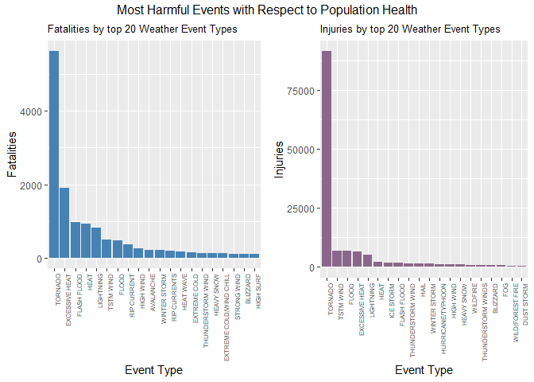
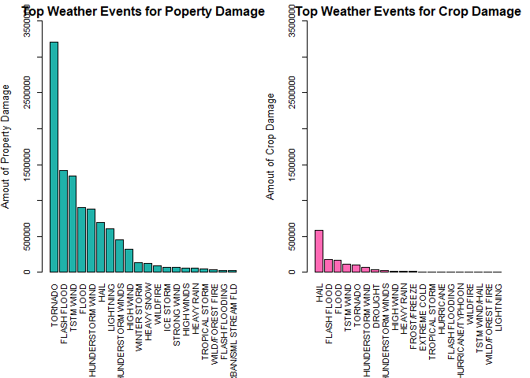
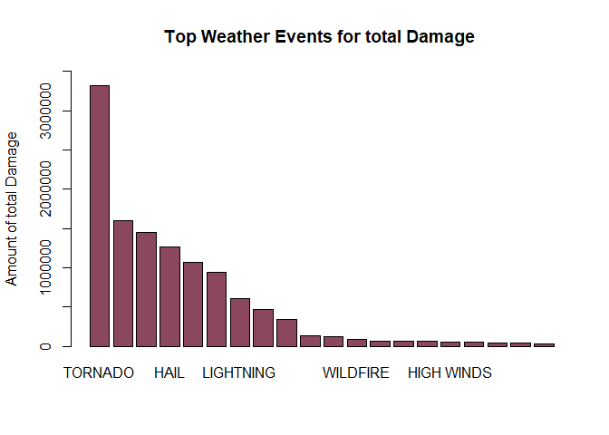

# **Introduction**
Storms and other severe weather events can cause both public health and economic problems for communities and municipalities. Many severe events can result in fatalities, injuries, and property damage, and preventing such outcomes to the extent possible is a key concern.

This project involves exploring the U.S. National Oceanic and Atmospheric Administration's (NOAA) storm database. This database tracks characteristics of major storms and weather events in the United States, including when and where they occur, as well as estimates of any fatalities, injuries, and property damage.

## Data
The data for this assignment come in the form of a comma-separated-value file compressed via the bzip2 algorithm to reduce its size. You can download the file from the course web site:

- [Storm Data](https://d396qusza40orc.cloudfront.net/repdata%2Fdata%2FStormData.csv.bz2)

The basic goal of this assignment is to explore the NOAA Storm Database and answer some basic questions about severe weather events. You must use the database to answer the questions below and show the code for your entire analysis. Your analysis can consist of tables, figures, or other summaries. You may use any R package you want to support your analysis.

## *Questions*

    1. Across the United States, which types of events (as indicated in the **EVTYPE** variable) are most harmful with respect to population health?  
    2. Across the United States, which types of events have the greatest economic consequences?


# **Data Processing**

```r
if (!file.exists("StormData.csv.bz2")) {
    fileURL <- 'https://d396qusza40orc.cloudfront.net/repdata%2Fdata%2FStormData.csv.bz2'
    download.file(fileURL, destfile='StormData.csv.bz2', method = 'curl')
}
noaaDF <- read.csv(bzfile('StormData.csv.bz2'),header=TRUE, stringsAsFactors = FALSE)
```
### Load Packages


### exploring data


We can select the variables that will help us to analyze the damage based on EVTYPE (event type), FATALITIES, INJURIES, PROPDMG (property damage), PROPDMGEXP (property damage expense), CROPDMG (crop damage), and CROPDMGEXP (crop damage expense). 

```r
NOAA <- noaaDF[,c('EVTYPE','FATALITIES','INJURIES', 'PROPDMG', 'PROPDMGEXP', 'CROPDMG', 'CROPDMGEXP')]

## View headers in revised data set
head(NOAA)
```

```
##    EVTYPE FATALITIES INJURIES PROPDMG PROPDMGEXP CROPDMG CROPDMGEXP
## 1 TORNADO          0       15    25.0          K       0           
## 2 TORNADO          0        0     2.5          K       0           
## 3 TORNADO          0        2    25.0          K       0           
## 4 TORNADO          0        2     2.5          K       0           
## 5 TORNADO          0        2     2.5          K       0           
## 6 TORNADO          0        6     2.5          K       0
```


```r
## Organize type of event ~ fatalities and store in object "fatalities" & same for "injuries"
fatalities <- aggregate(FATALITIES ~ EVTYPE, data=NOAA, sum)
injuries <- aggregate(INJURIES ~ EVTYPE, data = NOAA, sum)

## Sort fatalities
fatalities <- fatalities[order(-fatalities$FATALITIES), ][1:20, ]
fatalities$EVTYPE <- factor(fatalities$EVTYPE, levels = fatalities$EVTYPE)
head(fatalities)
```

```
##             EVTYPE FATALITIES
## 834        TORNADO       5633
## 130 EXCESSIVE HEAT       1903
## 153    FLASH FLOOD        978
## 275           HEAT        937
## 464      LIGHTNING        816
## 856      TSTM WIND        504
```


```r
## Sort Injuries
injuries <- injuries[order(-injuries$INJURIES), ][1:20, ]
injuries$EVTYPE <- factor(injuries$EVTYPE, levels = injuries$EVTYPE)
head(injuries)
```

```
##             EVTYPE INJURIES
## 834        TORNADO    91346
## 856      TSTM WIND     6957
## 170          FLOOD     6789
## 130 EXCESSIVE HEAT     6525
## 464      LIGHTNING     5230
## 275           HEAT     2100
```
# **Results**  

## *Question 1*
**Across the United States, which types of events (as indicated in the *EVTYPE* variable) are most harmful with respect to population health?**

```r
p1 = ggplot(fatalities, aes(x = EVTYPE, y = FATALITIES, theme_set(theme_bw()))) + 
    geom_bar(stat = "identity", fill = "steelblue") + 
    theme(axis.text.x = element_text(angle = 90, hjust = 1, size = 6)) + 
    xlab("Event Type") + ylab("Fatalities") + ggtitle("Fatalities by top 20 Weather Event Types") +
    theme(plot.title = element_text(size = 10))

p2 = ggplot(injuries, aes(x = EVTYPE, y = INJURIES, theme_set(theme_bw()))) + 
    geom_bar(stat = "identity", fill = "plum4") + 
    theme(axis.text.x = element_text(angle = 90, hjust = 1, size = 6)) + 
    xlab("Event Type") + ylab("Injuries") + ggtitle("Injuries by top 20 Weather Event Types") +
    theme(plot.title = element_text(size = 10))

## Plot both side by side using gridExtra package
grid.arrange(p1, p2, ncol = 2, top = "Most Harmful Events with Respect to Population Health")
```

<!-- -->

As show in the plot Tornado is the event type that has the highest level of Fatalities and Injuries.

### *Question 2*
**Across the United States, which types of events have the greatest economic consequences?** 

We proceed to calculate the costo of property and crop damages.


```r
## property
prop <- aggregate(NOAA$PROPDMG, by = list(NOAA$EVTYPE), "sum")
names(prop) <- c("Event", "Property")
prop_sorted <- prop[order(-prop$Property), ][1:20, ]
head(prop_sorted)
```

```
##                 Event  Property
## 834           TORNADO 3212258.2
## 153       FLASH FLOOD 1420124.6
## 856         TSTM WIND 1335965.6
## 170             FLOOD  899938.5
## 760 THUNDERSTORM WIND  876844.2
## 244              HAIL  688693.4
```
Crop


```r
crop <- aggregate(NOAA$CROPDMG, by = list(NOAA$EVTYPE), "sum")
names(crop) <- c("Event", "Crop")
crop_sorted <- crop[order(-crop$Crop), ][1:20, ]
head(crop_sorted)
```

```
##                 Event      Crop
## 244              HAIL 579596.28
## 153       FLASH FLOOD 179200.46
## 170             FLOOD 168037.88
## 856         TSTM WIND 109202.60
## 834           TORNADO 100018.52
## 760 THUNDERSTORM WIND  66791.45
```
### **Plot**


```r
par(mfrow = c(1, 2), mar = c(10, 4, 2, 2), las = 3, cex = 0.7, cex.main = 1.4, cex.lab = 1.2)

barplot(prop_sorted$Property, names.arg = prop_sorted$Event, col= "lightseagreen", main="Top Weather Events for Poperty Damage", ylab="Amout of Property Damage", ylim=c(0,3500000))

barplot(crop_sorted$Crop, names.arg = crop_sorted$Event, col= "hotpink", main="Top Weather Events for Crop Damage", ylab="Amout of Crop Damage", ylim=c(0,3500000))
```

<!-- -->

```r
## Considering both, property and crop
TotalCost <- aggregate(NOAA$CROPDMG+NOAA$PROPDMG, by = list(NOAA$EVTYPE), "sum")
names(TotalCost) <- c("Event", "TotalCost")
total_sorted <- TotalCost[order(-TotalCost$TotalCost), ][1:20, ]
head(total_sorted)
```

```
##                 Event TotalCost
## 834           TORNADO 3312276.7
## 153       FLASH FLOOD 1599325.1
## 856         TSTM WIND 1445168.2
## 244              HAIL 1268289.7
## 170             FLOOD 1067976.4
## 760 THUNDERSTORM WIND  943635.6
```


```r
barplot(total_sorted$TotalCost, names.arg = total_sorted$Event, col = 'palevioletred4',
        main = 'Top Weather Events for total Damage ', ylab = 'Amount of total Damage', ylim = c(0, 3500000))
```

<!-- -->

We can confirm that Tornadoes are the main cause for damage. 
